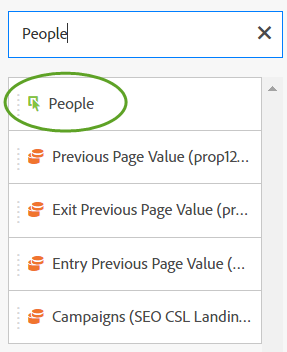

# People metric{#people-metric}

The People metric is the count of people (or groups of devices) based on Adobe's Device Graph. You can apply the People metric to identify visitors across their devices in Analysis Workspace.

## People Metric Prerequisites and Considerations {#section-34551d0435fb4b3cb3fad736b7961541}

<table id="table_120F7EF50042485391E58B22DD00A2A8"> 
 <thead> 
  <tr> 
   <th colname="col1" class="entry"> Prerequisite or Consideration </th> 
   <th colname="col2" class="entry"> Description </th> 
  </tr>
 </thead>
 <tbody> 
  <tr> 
   <td colname="col1"> 
Device Co-op 
 </td> 
   <td colname="col2"> 
 To use the People metric, become a member of the <a href="http://landing.adobe.com/en/na/events/summit/275658-summit-co-op.html" format="html" scope="external"> Adobe Experience Cloud Device Co-op</a>. The co-op identifies a person's multiple devices (or Experience Cloud IDs). Analytics leverages this information to statistically derive the number of people that interact with a brand. The metric is accurate to within 5%. 
 
<b>Regions</b>: The Device Co-op is currently available in the US and Canada only. Therefore, when evaluating the People metric, you should apply a segment to your analysis that filters your data for the US and Canada only. 
 
Each week the Device Graph calculates a new version of the co-op and publishes it for use. On Tuesdays, the system collects the latest data and publishes an updated version of the graph. Experience Cloud solutions then use the latest version of the graph. Specifically for Analytics, the changes are read in on Wednesdays and processing the changes typically takes between 1 and 2 business days. 
 
 
Important:  When the graph updates on a weekly basis, it can impact the People metric historically. In other words, historical People counts can change over time as the graph learns and is updated. For example, if you run a report today that counts People last month, and then run the same report in a week after the graph has updated, the historical People count can change slightly. 
 
 </td> 
  </tr> 
  <tr> 
   <td colname="col1"> Metric Permissions </td> 
   <td colname="col2"> 
You can use the People metric only if you have been granted access to it. Administrators can<a href="https://docs.adobe.com/content/help/en/analytics/admin/user-product-management/customize-report-access/groups-metrics.html" format="html" scope="external"> customize metrics permissions</a> in the Admin Tools. 
 </td> 
  </tr> 
  <tr> 
   <td colname="col1"> Mapping to IMS org </td> 
   <td colname="col2"> 
The People Metric will be enabled for all report suites that are <a href="https://docs.adobe.com/content/help/en/core-services/interface/about-core-services/report-suite-mapping.html" format="html" scope="external"> mapped to an IMSORG</a>. 
 </td> 
  </tr> 
  <tr> 
   <td colname="col1"> 
Analysis Projects / Tools 
 </td> 
   <td colname="col2"> 
Use the People metric in  Analysis Workspace,  Ad Hoc Analysis,  Report Builder, and via the API. You can use it wherever you would use the Unique Visitors metric, including Calculated Metrics. 
 
For example, create a revenue-per-person metric to replace a revenue-per-unique visitor metric. 
 
A <a href="https://docs.adobe.com/content/help/en/analytics/analyze/analysis-workspace/build-workspace-project/starter-projects.html" format="html" scope="external"> People project template</a> is available to get started using the People metric in Analysis Workspace. 
 </td> 
  </tr> 
  <tr> 
   <td colname="col1"> 
Turn on bot rules 
 </td> 
   <td colname="col2"> 
Adobe recommends that you turn on <a href="https://docs.adobe.com/content/help/en/analytics/admin/admin-tools/bot-removal/bot-rules.html" format="html" scope="external"> Bot Rules</a>, especially when using the People metric. 
 
When a bot crawls your website, it artificially increases your Unique Visitor count. Removing bot traffic from your report suite provides a more accurate measurement of activity on your digital properties, both in terms of Unique Visitors and People. 
 
To do so, navigate to  Analytics &gt;  Admin &gt;  Report Suites. Select the correct report suite, and then go to  Edit Settings &gt;  General &gt;  Bot Rules. 
 </td> 
  </tr> 
  <tr> 
   <td colname="col1"> 
Segmentation considerations 
 </td> 
   <td colname="col2"> 
 When you use segments with the People metric, the metric reporting may be dramatically lower than expected. 
 
See <a href="../other-solutions/people.md#section-d03525420dbe48379fd95b230ef05885" format="dita" scope="local"> Using the People Metric with Segments</a>. 
 </td> 
  </tr> 
 </tbody> 
</table>

## What Is the People Metric? {#section-89e2b8f5e80f480391449fc8d1117a6a}

The People metric is an Analytics reporting metric that helps you attribute devices to people. It provides a people-based view of marketing, letting you measure visitors' activity across all of their devices. Think of it as a de-duplicated version of Unique Visitors, and you can use the People metric for analysis where you previously used Unique Visitors.

**Devices Are People**

Before the People metric became available, a person (for example) might visit your site and engage with a campaign or brand on three different devices and make a purchase, even doing so within minutes. Depending on your implementation, Analytics might report each device as a unique visitor and attribute $10 to three devices in a $30 purchase.

The People metric lets you accurately attribute that $30 purchase to one person:

**Increased Accuracy in Reports**

The People metric enables you to think of multiple devices as a single entity. The following Analysis Workspace project shows increased accuracy comparisons between Unique Visitors reporting and People reporting:

Compare People and Unique Visitors side-by-side:

**Definitions** 

<table id="table_F8171AF15DA64607B427E3739EF004D6"> 
 <thead> 
  <tr> 
   <th colname="col1" class="entry"> Item </th> 
   <th colname="col2" class="entry"> Description </th> 
  </tr>
 </thead>
 <tbody> 
  <tr> 
   <td colname="col1"> 
People 
 </td> 
   <td colname="col2"> 
The People metric is based on the idea that consumers interact with your brand using multiple devices. The more you slice or segment your data, the smaller the chance that the same person used multiple devices within that slice of data. 
 </td> 
  </tr> 
  <tr> 
   <td colname="col1"> 
Unique Visitors 
 </td> 
   <td colname="col2"> 
For example, the more you slice your data by date or time, the smaller the difference between People and Unique visitors will be. If you want a good understanding of the overall impact of the Device Co-op, Adobe recommends using a date range of the last 90 days 
 </td> 
  </tr> 
  <tr> 
   <td colname="col1"> 
Compression 
 </td> 
   <td colname="col2"> 
Using a simple calculated metric you can see how much smaller the People metric is as a percentage of Unique Visitors. Click on the info icon next to "Compression" in the table above to see how to create this metric. 
 
People can be used in other calculated metrics in place of Unique Visitors. 
 </td> 
  </tr> 
 </tbody> 
</table>

## How Is the People Metric Calculated? {#section-0dfb762867e14a7f927796ef3c50592b}

<!--

Analytics uses the HyperLogLog statistical algorithm to calculate People. This means that the smaller the data set, the margin for error may increase. No more than 5% of the numbers should be off by more than 5% 

-->

The following image shows how the People metric is calculated and how it can decrease over time for the same report date range in the past.

In this example, assume there is a fixed set of visitors. If you run a report for a fixed time frame in the past, it displays a fixed set of visitors. If the Device Graph outputs the data shown on the left graphic in week 1, that results in 90 People. A week later, after the next run of the Device Graph, new information is taken into account. If you run the same report that you did a week ago, the number of people has gone down to 84. History has changed because the Device Graph provided new information about which devices should be grouped together.

## Using the People Metric with Segments {#section-d03525420dbe48379fd95b230ef05885}

When you use segments with the People metric, the metric results may be dramatically lower than expected. This issue occurs because, in segmentation, there is no *`person`* container. Segmentation uses the Visitor container, which is the highest-level container in the definition and is based on the device, not on the person.

This issue occurs primarily when stacking segments with the People metric.

Stacking segments creates a new segment that represents the combination of the segments. Stacking segments occurs whenever you:

* Place a segment on top of another segment in Analysis Workspace. (These are automatically joined using the *`And`* operator.) 
* Apply a single segment that contains the *`And`* operator. 
* Apply a segment at both the project level and table level. 
* Use a virtual report suite with another segment.

For example, assume that you stack the following segments on the People metric:

* `Campaign = Spring Promotion` 
* `Site Section = Product Overview`

Only the number of people who qualify in both segments *`using a single device`* are counted. (The People metric does not display the number of qualifying people across devices.)

Also, using the *`Or`* operator is not recommended in this situation. Doing so would produce a count of people who saw one or the other, with no way of counting how many people qualify for both segments.

See [Building Segments](https://docs.adobe.com/content/help/en/analytics/components/segmentation/segmentation-workflow/seg-build.html) in the Segmentation help for more information.

## Device Types {#section-8ab378c84ff34574b9c20fecb3848a86}

The Device Co-op and People metric work best in Adobe Analytics when your report suite contains data from multiple device types. For example, combining web and app data in the same report suite makes the People metric more powerful and effective. The more device crossover in your data, the greater the chance that multiple unique visitors will be grouped together as a single person.

## Experience Cloud ID Service Coverage {#section-bbf0098cac2e467289e7a644a1dea05c}

The Device Co-op requires your digital properties to be instrumented using the Experience Cloud ID (MCID) service. If the data in your report suite contains a significant number of visitors without an MCID, the effectiveness of the Device Co-op and the People metric is diminished.

<!--
mcdc-people-metric-apply.xml
-->

In Analysis Workspace, create a [project](https://docs.adobe.com/content/help/en/analytics/analyze/analysis-workspace/build-workspace-project/t-freeform-project.html), then drag the **[!UICONTROL People]** metric to the project table:

