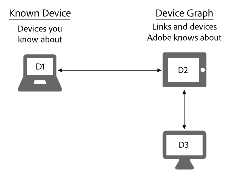

# Known devices{#known-devices}

About known devices in the Device Graph.

In the Device Graph, we have the concept of a *`known device`*. A known device is a device a customer uses to interact with your brand.

>[!NOTE]
>
>In the [!DNL Adobe Experience Cloud Device Co-op], terms such as *`device`*, *`person`*, *`identity`* etc. have specific meanings. For example, "device" can refer to physical hardware such as a phone or tablet and the applications that run on that hardware. See the [glossary](../glossary.md#glossgroup-0f47d7fbd76c4759801f565f341a386c) for definitions.

## Supporting goals with the known device {#section-80deae33660e4280ac65c659ceff5601}

The known device concept supports a few goals essential to the creation and maintenance of an effective [!DNL Device Co-op] program. A known device is one that a [!DNL Device Co-op] member knows about from some interaction with a consumer (e.g., a site visit or by using a mobile app). Based on these actions, the [!DNL Device Graph] links the known devices of a [!DNL Device Co-op] member to devices contributed by other [!DNL Device Co-op] members. These links can be [deterministic or probabilistic](../processes/links.md#concept-58bb7ab25f904f5f98d645e35205c931). This benefits [!DNL Device Co-op] members because they receive:

* More data about their known devices. 
* New information about other, linked devices.

The [!DNL Device Graph] will not provide information about device-clusters that a Device Co-op member has not seen.

## Device Co-op goals {#section-75aea5a102d54733aae2a7c6ee9ec6c7}

Three main goals animate the [!DNL Device Co-op]. These include:

* **Scale:** Share the maximum number of possible links across a variety of use cases. 
* **Fairness:** Ensure that each member of the [!DNL Device Co-op] benefits in a manner commensurate with their contributions. 

* **Consumer trust:** Maintain and build consumer confidence by making sure the consumer cross-device experience involves brands they already know and trust.

## Scale and the known device {#section-67f734109762457ca62ec306284ea082}

The following methods are the more common ways a device qualifies as a known device. Given these methods, [!DNL Device Co-op] members will almost always have at least 1 known device. This supports the goal of providing maximum scale to all the members of the [!DNL Device Co-op].

**Organic**

* From a customer's visit to your site or by using your app. This is qualification from first-party data. 
* By on-boarding customers from a CRM system.

**Marketplace**

* Purchasing segment data from Audience Marketplace.
* From purchasing data from a third-party data provider.

**Advertising**

By winning inventory in an auction and serving an ad to a device. The device becomes a known device if that ad contains an [!DNL Audience Manager] pixel.

## Known devices and fairness use cases {#section-0543188729d845d6b95db70b8b25e9f8}

Members of the [!DNL Device Co-op] get links commensurate with their contributions to the [!DNL Device Graph]. Companies that contribute a lot of devices to the [!DNL Device Graph] receive more links than members who contribute just a few. We believe this helps make the [!DNL Device Co-op] fair for all its members. Let's look at how this works with the large and small use cases described below.

**Brand A: large use case**

In this example, Brand A has 100 site visitors each month and starts a new cross-device, brand campaign. For simplicity, assume the [!DNL Device Graph] knows all of the visitors to Brand A are linked to 1 additional device. This means Brand A could reach another 100 devices. Additionally, the [!DNL Device Graph] contains about 200 devices linked together.

<table id="table_78C38DC522F94BC38C1DB73740C058AC"> 
 <thead> 
  <tr> 
   <th colname="col1" class="entry"> Known Devices/Month </th> 
   <th colname="col2" class="entry"> Linked Devices Received from Device Co-op </th> 
   <th colname="col3" class="entry"> Total Devices for Campaign </th> 
  </tr>
 </thead>
 <tbody> 
  <tr> 
   <td colname="col1"> 
100 
 </td> 
   <td colname="col2"> 
100 
 </td> 
   <td colname="col3"> 
200 
 </td> 
  </tr> 
 </tbody> 
</table>

**Brand B: Small Use Case**

In this example, Brand B has 100 site visitors each month and starts a new cross-device, brand campaign. For simplicity, assume the [!DNL Device Graph] knows all of the visitors to Brand B are linked to 50 additional devices. This means Brand B could reach 150 devices. Additionally, the [!DNL Device Graph] contains about 1,000 devices linked together.

<table id="table_A6C9CCF9C6564A89BA7060E075A8E73C"> 
 <thead> 
  <tr> 
   <th colname="col1" class="entry"> Known Devices/Month </th> 
   <th colname="col2" class="entry"> Linked Devices Received from Device Co-op </th> 
   <th colname="col3" class="entry"> Total Devices for Campaign </th> 
  </tr>
 </thead>
 <tbody> 
  <tr> 
   <td colname="col1"> 
100 
 </td> 
   <td colname="col2"> 
50 
 </td> 
   <td colname="col3"> 
150 
 </td> 
  </tr> 
 </tbody> 
</table>

>[!MORELIKETHIS]
>
>* [Unknown Devices](../processes/unknown-device.md#concept-95090d341cdc4c22ba4319d79d8f6e40)
